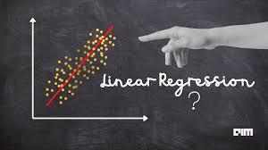

# ft_linear_regression [(subject)](https://cdn.intra.42.fr/pdf/pdf/30249/fr.subject.pdf)



  
## Introduction

Machine learning is a growing field of computer science that may seem a bit complicated and reserved only to mathematicians. You may have heard of neural networks or k-means clustering and don’t undersdand how they work or how to code these kinds of algorithms... But don’t worry, we are actually going to start with a simple, basic machine learning algorithm.

## Objective

The aim of this project is to introduce you to the basic concept behind machine learning. For this project, you will have to create a program that predicts the price of a car by using a [linear function](https://en.wikipedia.org/wiki/Linear_function) train with a [gradient descent algorithm](https://en.wikipedia.org/wiki/Gradient_descent). We will work on a precise example for the project, but once you’re done you will be able to use the algorithm with any other dataset.

## How to run

Create a virtual environment and activate it
```bash
> python -m venv venv
> .\venv\Scripts\activate.bat # on Windows
```

Install the pre-requirement: 
```bash
(venv) > pip install -U -r pre-requirements.txt
```

Execute `setup.py`:
```bash
(venv) > pip install --editable .[dev] #[dev] to build in dev mode.
```

Launch `linear_regression`:

```bash
(venv) λ linear_regression --help
Usage: linear_regression [OPTIONS] COMMAND [ARGS]...

Options:
  --help  Show this message and exit.

Commands:
  learn
  predict
  set-theta
```

## Resources

* [https://www.stat4decision.com/fr/faire-regression-lineaire-r-python/](https://www.stat4decision.com/fr/faire-regression-lineaire-r-python/)
* [https://www.datacorner.fr/gradient-descent/](https://www.datacorner.fr/gradient-descent/)
* [https://www.netlib.org/utk/lsi/pcwLSI/text/node226.html](https://www.netlib.org/utk/lsi/pcwLSI/text/node226.html) 
* [https://developers.google.com/machine-learning/crash-course/glossary?hl=fr#scaling](https://developers.google.com/machine-learning/crash-course/glossary?hl=fr#scaling) 
* [https://www.math.univ-toulouse.fr/~besse/Wikistat/pdf/st-l-inf-regsim.pdf](https://www.math.univ-toulouse.fr/~besse/Wikistat/pdf/st-l-inf-regsim.pdf) 
* [https://www.colorado.edu/amath/sites/default/files/attached-files/ch12_0.pdf](https://www.colorado.edu/amath/sites/default/files/attached-files/ch12_0.pdf)
* [https://mrmint.fr/regression-lineaire-python-pratique](https://mrmint.fr/regression-lineaire-python-pratique)
* [https://machinelearnia.com/regression-lineaire-simple/](https://machinelearnia.com/regression-lineaire-simple/)